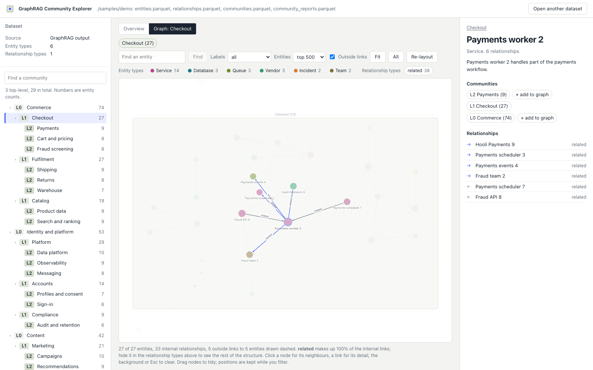
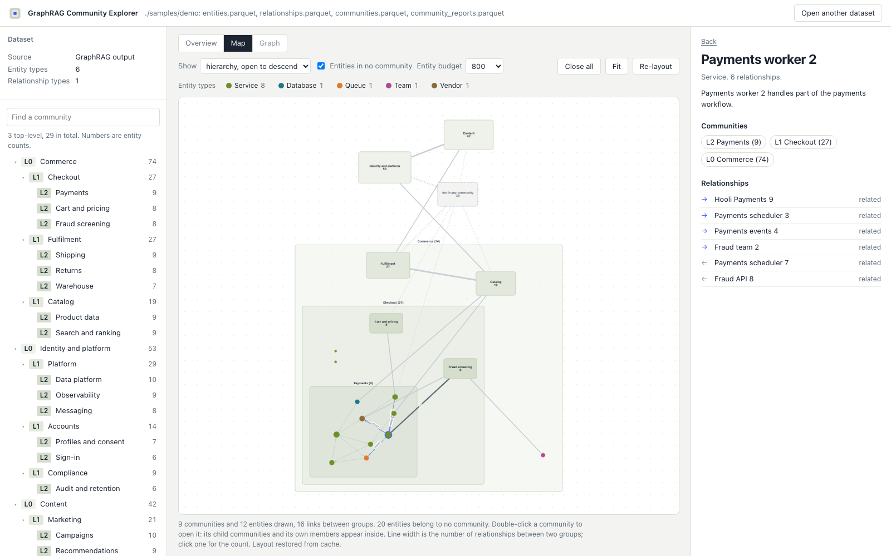

# GraphRAG Community Explorer

Community-first explorer for [Microsoft GraphRAG](https://github.com/microsoft/graphrag) outputs.
Open the Parquet files GraphRAG writes, read the community hierarchy and reports first, then descend
into the entities and relationships inside each community. Everything runs in your browser; no file
is uploaded anywhere.

Status: 0.1 alpha. Loader, overview, hierarchy tree, community table, report inspector, integrity
checks, community graph, community map, quality metrics, partition comparison and source-text
evidence are in place; see [docs/ROADMAP.md](docs/ROADMAP.md) for what comes next.






## Try it

```sh
npm install
npm run dev          # http://127.0.0.1:5173
```

Click **Open the sample dataset**, or drop your GraphRAG `output/` folder onto the page.

Live demo with the sample: https://workdd.github.io/graphrag-community-explorer/

To work with your own index every day, put its files under `local-data/<name>/` (ignored by Git and
served only by the dev server) and open `http://127.0.0.1:5173/?data=./data/<name>`. To make it open
by default, copy `.env.example` to `.env.development.local` and set `VITE_DEFAULT_DATA=./data/<name>`.
Any folder served over HTTP works the same way with `?data=<url>`.

To serve a built copy together with an index folder, without the dev server:

```sh
npm run build
npm run serve -- --data ~/graphrag/output     # http://127.0.0.1:4180/?data=./data/output
```

## What it reads

| File | Used for |
| --- | --- |
| `entities.parquet` | Entity titles, types, descriptions. Required. |
| `relationships.parquet` | Edges between entity titles. Required. |
| `communities.parquet` | Levels, parents, members. Without it there is no hierarchy. |
| `community_reports.parquet` | Summaries, findings and ranks. |
| `text_units.parquet`, `documents.parquet` | Source chunks and documents; the inspector shows the text behind an entity, relationship or community. |
| `<label>_communities.parquet` | Any additional community set (for example `leiden_communities.parquet`) becomes a switchable partition. |

File names from GraphRAG 0.3 to 2.x are recognized, including the `create_final_` prefix. When an
older output has no `entity_ids` column, members are inferred from `relationship_ids` and the
integrity panel says so. Exports from Apache AGE that follow the same layout load as well.

## What you see

- A one-paragraph summary with the counts that matter: entities, relationships, communities, levels,
  coverage, isolated entities.
- The hierarchy as a tree, with depth shown by indentation and tint, not by force layout.
- A sortable table of communities with internal and boundary relationship counts.
- The community report (summary, findings, rank), parent path, child communities and members.
- Integrity findings: duplicate ids, unresolved members or parents, children not nested in their
  parent, size mismatches, dangling relationships.
- The community map: the whole dataset as community boxes sized by member count, linked by lines
  whose width is the number of relationships between two groups. Double-click a box to open it;
  in a nested hierarchy its child communities and its own members appear inside, otherwise its
  members do and dashed arrows show parents. Entities in no community form their own box. Layouts
  run in a web worker and are cached, so the same picture comes back instantly.
- Quality: modularity and coverage per level, size distributions, density and conductance per
  community, and a side-by-side comparison of two community sets (NMI, ARI, overlap table).
- Evidence: the text units and documents behind an entity, relationship or community, when the
  index shipped them.
- The community graph: members drawn inside the community container, colored by entity type and
  sized by degree, with labels that stay readable. Outside links reach dashed ghost nodes, and any
  neighbouring community can be added to the same picture. Click a node for its neighbourhood and
  incoming/outgoing links, a link for its description; filter relationship types, search, and drag
  nodes. Layouts are deterministic and survive filtering.

## Development

```sh
npm run typecheck
npm test             # vitest: loaders, hierarchy, metrics, map model, evidence
npm run e2e          # Playwright smoke test against the production build (uses installed Chrome)
npm run build        # vite build, then scripts/check-dist.mjs refuses any dataset but the sample
npm run hooks        # installs the pre-push check once per clone
uv run samples/generate_sample.py   # regenerates the synthetic sample
```

Two checks keep private data out of the open: `scripts/check-sensitive.sh` runs before every push
and in CI and refuses data files outside `public/samples/`, environment files and identifiers that
only occur in private exports; `scripts/check-dist.mjs` runs after every build and fails if `dist/`
would publish anything but the sample. Real indexes belong in `local-data/`, which Git ignores and
the build never copies.

See [CONTRIBUTING.md](CONTRIBUTING.md) for the workflow and [CHANGELOG.md](CHANGELOG.md) for releases.

## License

MIT. This project started as a fork of
[GraphRAG Visualizer](https://github.com/noworneverev/graphrag-visualizer); see
[THIRD_PARTY_NOTICES.md](THIRD_PARTY_NOTICES.md). The forked code lives on the `legacy-prototype`
branch and is not used by the current application.

---

## 한국어 안내

GraphRAG 산출물(Parquet)을 커뮤니티 단위로 읽는 뷰어입니다. 계층 트리와 커뮤니티 표, 보고서(요약·발견·순위),
무결성 검사가 먼저 나오고, 그래프는 선택한 커뮤니티 안에서만 엽니다. 모든 처리는 브라우저 안에서 끝나며 파일은
어디에도 업로드되지 않습니다.

- 실행: `npm install` 후 `npm run dev`, 그리고 **Open the sample dataset** 또는 GraphRAG `output/` 폴더를 드롭.
- 로컬 실데이터: `local-data/<이름>/` 에 두고 `?data=./data/<이름>` 으로 엽니다. 이 폴더는 Git 이 무시하고 빌드에도 들어가지 않습니다. `.env.development.local` 에 `VITE_DEFAULT_DATA=./data/<이름>` 을 적으면 시작 시 바로 열립니다.
- 추가 커뮤니티 집합: `<라벨>_communities.parquet` 파일을 함께 올리면 상단에서 전환할 수 있습니다.
- 푸시 전 검사: `npm run hooks` 로 pre-push 훅을 설치하면 실데이터·환경 파일·사내 식별자가 섞인 커밋을 막습니다.
