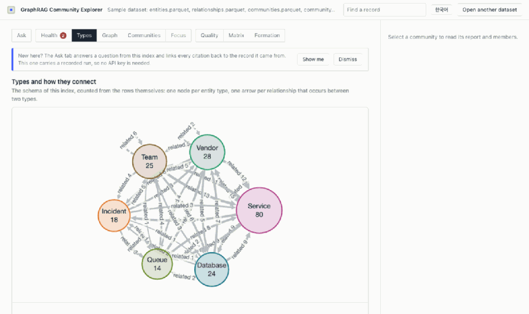
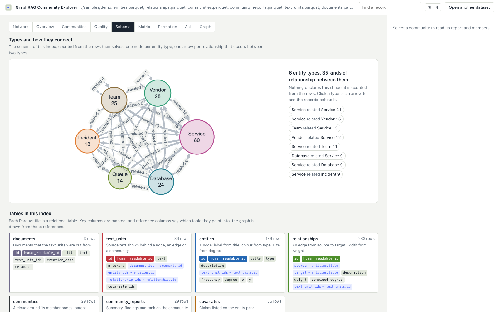
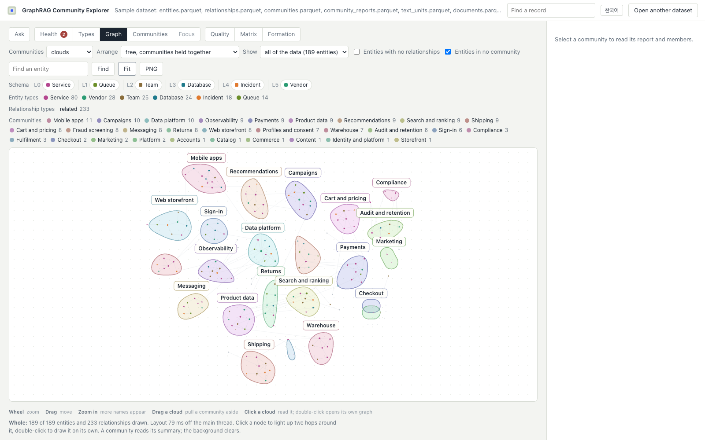
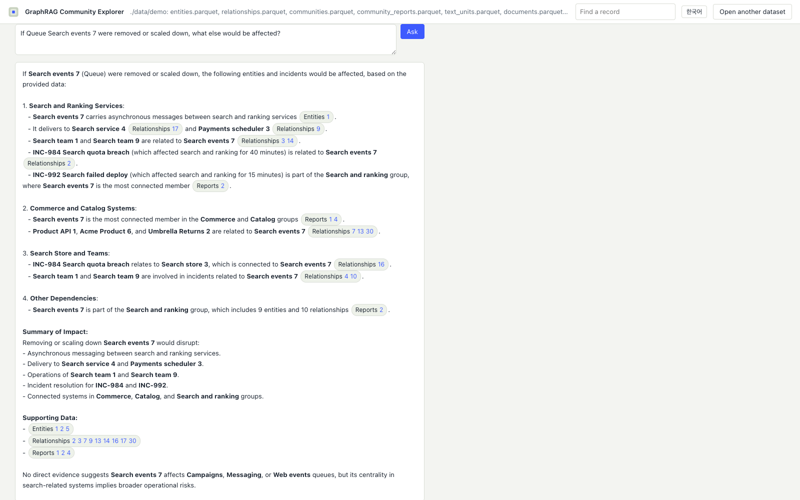
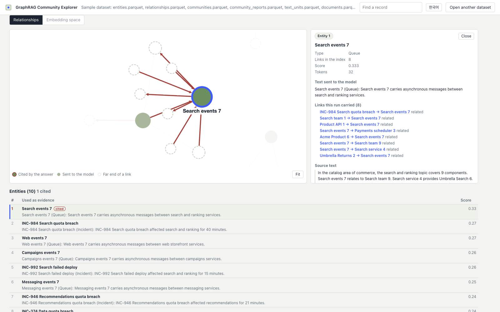
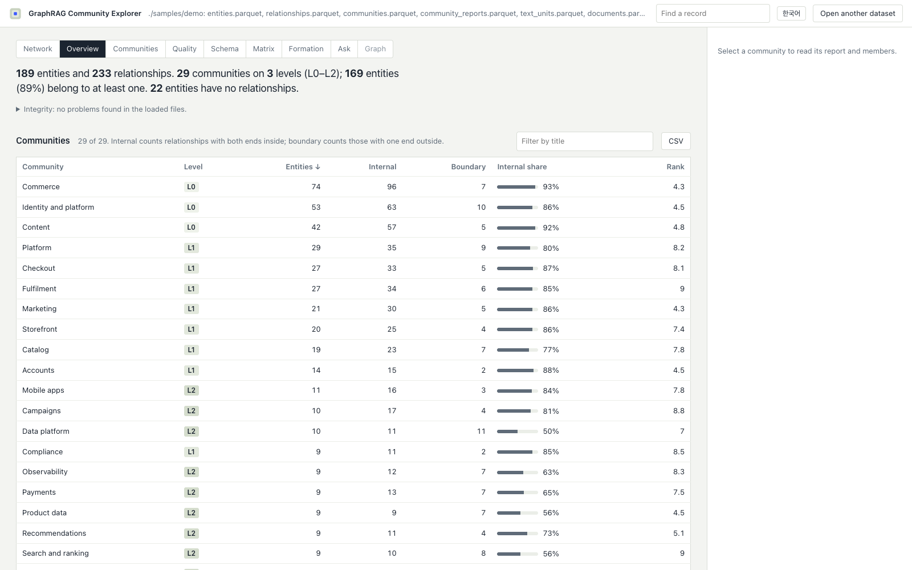
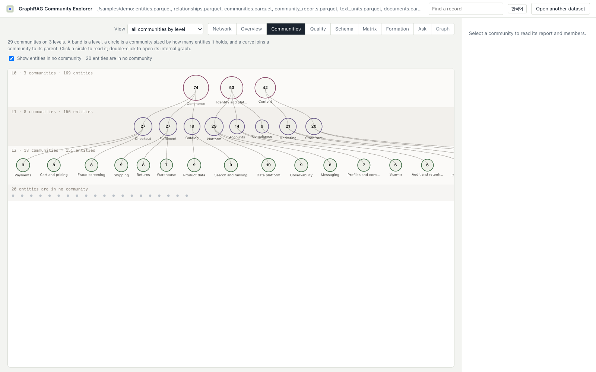

# GraphRAG Community Explorer

**English** · [한국어](README.ko.md)

**Open a [Microsoft GraphRAG](https://github.com/microsoft/graphrag) index in your browser, ask it a
question, and follow the answer back to the exact records it used.** No server, no install, nothing
uploaded.

[](https://workdd.github.io/graphrag-community-explorer/)
[](LICENSE)
[](#try-it)
[](#what-it-reads)



**[Open the demo](https://workdd.github.io/graphrag-community-explorer/) → Ask → See a saved run.**
No API key needed: the sample ships with a recorded run, so the whole answer-to-evidence path is one
click away.

## Why this and not a graph viewer

A graph viewer draws your nodes. This draws the way GraphRAG actually organizes them, and then shows
you what a search does with them.

- **Communities first, not a hairball.** The index opens on its own schema and its community
  hierarchy, because that is what GraphRAG builds and what nothing else shows.
- **Answers you can check.** Every citation is a button that opens the record it names, with the
  exact text that went into the prompt. Records that were retrieved and *not* cited stay on screen
  too, so what the model ignored is as visible as what it used.
- **The pipeline is on screen.** The retrieval, the token budget, each model call with its measured
  milliseconds, and the prompt verbatim. Local and global search both, following GraphRAG's methods.
- **Nothing to stand up.** A folder of Parquet and a browser tab. The official
  `unified-search-app` needs Python, Streamlit and a pinned GraphRAG install.

Status: 0.3, alpha. Loader, schema view, network view, community hierarchy and map, report
inspector, integrity checks, quality metrics, partition comparison, source-text evidence and the
Ask tab (local and global search against your own provider) are in place; see
[docs/ROADMAP.md](docs/ROADMAP.md) for what comes next.













## Try it

```sh
npm install
npm run dev          # http://127.0.0.1:5173
```

Click **Open the sample dataset**, or drop your GraphRAG `output/` folder onto the page.

Live demo with the sample: https://workdd.github.io/graphrag-community-explorer/

To work with your own index every day, put its files under `local-data/<name>/` (ignored by Git and
served only by the dev server) and open `http://127.0.0.1:5173/?data=./data/<name>`. To make it open
by default, copy `.env.example` to `.env.development.local` and set `VITE_DEFAULT_DATA=./data/<name>`.
Any folder served over HTTP works the same way with `?data=<url>`.

To serve a built copy together with an index folder, without the dev server:

```sh
npm run build
npm run serve -- --data ~/graphrag/output     # http://127.0.0.1:4180/?data=./data/output
```

Once the package is on npm the same server runs without a checkout:

```sh
npx graphrag-community-explorer --data ~/graphrag/output
```

A `Dockerfile` builds a static image served by nginx; mount an index folder under
`/usr/share/nginx/html/data/<name>` and open `?data=./data/<name>`. It has not been exercised on a
machine with Docker yet.

## Ask a question

The **Ask** tab answers from the index you have open, using a model provider you configure. It
follows GraphRAG's two search methods; the selection and the budgeting are this project's own, so an
answer here is not guaranteed to match what `graphrag query` returns from the same index.

- **Local** embeds the question, ranks entities by cosine against the entity vectors, and packs the
  seeds, the relationships between them, the reports of the communities they belong to, the source
  chunks behind them and the claims about them into a token budget, in that order of priority. It
  needs an `embeddings.parquet` beside the index.
- **Global** reads the community reports, splits them into context windows, asks the model for
  scored points from each window, keeps the best of them and asks once more for the answer. It needs
  `community_reports.parquet` and no embeddings, which is how GraphRAG's global search works too.

Before configuring anything, you can read a run that was recorded earlier. The shipped sample
carries one, and the tab offers it as **See a saved run**: a real answer, with its citations, its
evidence graph and the records it passed over, all resolving against the index in front of you. Drop
an `example-run.json` next to your own index and it does the same there; **Save this run** writes
the file.

Any OpenAI-compatible endpoint will do. The key lives in your browser's local storage, never in a
saved run and never in a log line. Presets for Upstage and OpenAI fill in the two model names; the
embedding model matters, because a question embedded with a different model than the sidecar was
built with ranks nothing usefully.

To skip typing the settings in every browser, copy `.env.example` to `.env.development.local` and
set `VITE_LLM_BASE_URL`, `VITE_LLM_CHAT_MODEL`, `VITE_LLM_EMBED_MODEL` and, if you accept the
consequence, `VITE_LLM_API_KEY`. Vite inlines those into the bundle, so `npm run build` refuses to
publish a key unless `ALLOW_EMBEDDED_KEY=1` says it may. Anything typed in the app wins over the
environment.

Local search needs entity vectors, which GraphRAG writes to a vector store rather than to Parquet.
`tools/embed_index` builds the sidecar the browser can read:

```sh
EMBED_API_KEY=… python3 tools/embed_index/embed_index.py --index ~/graphrag/output
```

It writes `embeddings.parquet` next to the index: one row per entity, the vector as fixed-length
binary, and the model, the dimension and a SHA-256 of every source file in the file's metadata. The
app checks those fingerprints and turns local search off, saying which file changed, when the
sidecar was made from a different index.

What comes back is meant to be checked rather than believed:

- Every citation in the answer is a button. Picking one reads that record beside the answer, with
  the exact text that went into the prompt, the links the run carried and the source text behind it.
- The evidence graph draws the records that were sent to the model and outlines in red the ones the
  answer actually cited. A node, a citation and a table row are three views of the same record, and
  picking any of them reads it in place. Nothing sends you to another tab.
- The table under the graph lists everything that was retrieved with its score, so the records the
  model was given and ignored are as visible as the ones it used.
- The embedding space plots the question and the entity vectors, reduced with PCA, in two or three
  dimensions, marking what went into the prompt and what the budget cut. It says on the screen that
  distance there is not the cosine the search used.
- **How a question reaches an answer** draws the run itself: retrieval, context window, model call
  and response, with the counts and milliseconds this run actually spent, and the calls that left
  the browser bordered in red. **Show the prompt sent to the model** prints the messages verbatim.
- **Save this run** writes a trace file (question, settings without the key, every context record,
  the answer and the timings); **Open a trace** reads one back and relinks its citations, so a run
  can be reviewed on a machine with no key at all.

Example questions are offered from the data itself: entities that are actually reachable, named with
their schema type, weighted towards the kinds of record people ask impact questions about.

## What it reads

| File | Used for |
| --- | --- |
| `entities.parquet` | Entity titles, types, descriptions. Required. |
| `relationships.parquet` | Edges between entity titles. Required. |
| `communities.parquet` | Levels, parents, members. Recommended: without it only the entity list and neighbourhood graphs are available (`public/samples/minimal` is such a set). |
| `community_reports.parquet` | Summaries, findings and ranks. Global search reads these. |
| `text_units.parquet`, `documents.parquet` | Source chunks and documents; the inspector shows the text behind an entity, relationship or community. |
| `covariates.parquet` | Claims about entities, listed on the entity panel and offered to local search. |
| `embeddings.parquet` | Optional sidecar of entity vectors written by `tools/embed_index`. Local search and the embedding space need it; nothing else does. |
| `<label>_communities.parquet` | Any additional community set (for example `leiden_communities.parquet`) becomes a switchable partition. |
| `example-run.json` | Optional saved run. When a folder carries one, the Ask tab offers it as one click, so the tab can be read before any provider is configured. |

Levels are shown from the root down: the root reads L0 and children count up, which is GraphRAG's
own numbering. A file that numbers its roots highest (Apache AGE resource tiers) or starts at one is
renumbered for display only, with the file's own number in the tooltip and a note under the tree.

Several folders can be offered at once. `npm run serve -- --data a --data b` and the dev server both
publish `data/index.json`, and the app turns it into buttons on the load screen and a picker in the
top bar. A folder's `manifest.json` may carry `"label"` to name it there.

File names from GraphRAG 0.3 to 2.x are recognized, including the `create_final_` prefix. When an
older output has no `entity_ids` column, members are inferred from `relationship_ids` and the
integrity panel says so (`public/samples/legacy` is such a set). Exports from Apache AGE that
follow the same layout load as well.

Size: a synthetic index with 9,211 entities, 23,810 relationships and 1,537 communities opens in
under a second on a laptop; the collapsed map, the quality view and an 85-entity community graph
each take about half a second (`samples/generate_sample.py --scale 53 --edge-factor 5`).

## What you see

The app opens on the **Schema**: one node per entity type, one arrow per relationship that occurs
between two types, both with counts, and under it the Parquet tables with their key and reference
columns. Nothing declares this shape; it is counted from the rows. Picking a type or an arrow lists
the records behind it and carries over into the network as a filter you can clear.

Not every relationship is worth drawing as arrows. A triple that joins most of its possible pairs,
such as a permission block, is a hairball under any layout, and one that hangs everything off a few
hubs is really a list of counts. The schema view measures both and sends you to the form that reads:
a grid for a dense pair, counts per hub for a star, arrows for the rest.

The **Network** draws the records themselves: every entity and relationship on one canvas, with node
colour for the entity type and size for the degree. Communities are an overlay you add, as clouds
around their members or as node colour, and they can be taken away again. Turning the overlay on
takes you to the free layout, which keeps each community together already, so the hulls appear
around what is on screen instead of rearranging it; switching it off again moves nothing.

The free layout treats a community as a container the layout must not scatter, and gives a link that
leaves one a long ideal length while links inside it stay short. The clouds then come out as
separate petals rather than one smear. A tidier catalogue, one disc per community laid out in rows
with a guaranteed gap, is there as its own arrangement when that is what is wanted.

Names appear as there is room for them. On every pan and zoom the visible nodes are measured in
screen pixels and the best are named first, so a crowded picture names its hubs and the members of a
community, and zooming in reveals the rest instead of piling text on text. Zooming spreads the graph
out rather than magnifying it: dots and names hold their size on screen. Every cloud carries its
community's name at a fixed size, and where two names would land on top of each other the smaller
community gives way and gets its name back as you zoom in; every community is also listed under the
canvas with the colour it was drawn in, so no name is ever out of reach.

Clicking a record reads it where it stands. The graph stays exactly as it was; two hops around the
record light up, everything else fades to a ghost rather than disappearing, and the record and its
two rings hold a size on screen so they can be found with the whole graph in view. Double-clicking
is the deliberate step that redraws the picture around that one record: a few neighbours of each
kind are drawn with their names, everything else becomes a dashed bubble carrying a count, and a
second ring shows what those neighbours reach in turn. A role with 274 neighbours reads as twenty
nodes, and a bubble opens on click. Nothing anywhere asks you to choose a number of nodes: one
switch says part of the data or all of it, and part always means a couple of representatives plus a
count.

A type bubble is sized by how many records it stands for, so one type can be many times the width
of its neighbours and a force layout will drop the small ones inside the large one. Whatever the
layout decides, the picture is settled afterwards: overlapping bubbles are pushed apart until none
of them touch, names included, and the view is fitted again so nothing hangs over the edge. Parting
them changes the fit, which changes how large the names are on screen and so how much room they
need, so the three settle together over a few rounds.

`Arrange: layers` puts one column per entity type and orders the columns so that as many
relationships as possible run forward, using a greedy feedback arc set. It reports the share that
made it, and draws the rest dashed red. Long columns wrap into sub-columns so the picture stays
readable. Both Apache AGE graphs we test with reach 99%.

The **Communities** view opens on every community at once: one band per level from the root down,
one circle per community sized by the entities it holds, and a curve from each community to its
parent. Entities that no community claims are drawn as grey dots under the bands and can be switched
off. The nested box map, where a community opens into its members, is one switch away. Clicking
inside a community reads it on the right: its summary, its level, how much of its edge weight stays
inside, its children and its members. Dragging it moves the whole group, and double-clicking opens
its own graph.

The **Formation** view runs Leiden in the browser on the entities on screen and plays the run back:
local moving sweep by sweep, refinement, then aggregation, with the graph recolouring as communities
appear, a modularity curve, the shrinking working graph, and NMI/ARI against the community set the
index shipped. Resolution, seed and scope are yours to change; the loaded communities never are.

The rest, in short:

- A one-paragraph summary with the counts that matter: entities, relationships, communities, levels,
  coverage, isolated entities.
- The hierarchy as a tree, with depth shown by indentation and tint, not by force layout.
- A sortable table of communities with internal and boundary relationship counts.
- The community report (summary, findings, rank), parent path, child communities and members.
- Integrity findings: duplicate ids, unresolved members or parents, children not nested in their
  parent, size mismatches, dangling relationships.
- The community map: the whole dataset as community boxes sized by member count, linked by lines
  whose width is the number of relationships between two groups. Double-click a box to open it;
  in a nested hierarchy its child communities and its own members appear inside, otherwise its
  members do and dashed arrows show parents. Entities in no community form their own box. Layouts
  run in a web worker and are cached, so the same picture comes back instantly.
- Quality: modularity and coverage per level, size distributions, density and conductance per
  community, and a side-by-side comparison of two community sets (NMI, ARI, overlap table).
- Evidence: the text units and documents behind an entity, relationship or community, when the
  index shipped them; claims from `covariates.parquet` on the entity panel.
- Neighbourhood exploration: from any entity, everything within 1, 2 or 3 hops across community
  boundaries, drawn inside the communities it belongs to.
- Readable at scale: a hub-and-spoke relationship type that owns most of a big community's links
  starts hidden (one click brings it back), degree-one leaves of one type on the same hub fold into
  a single node, and communities can be drawn as translucent clouds around their members instead of
  boxes. Every view and selection is a browser history entry, so the back button works.
- The community graph: members drawn inside the community container, colored by entity type and
  sized by degree, with labels that stay readable. Outside links reach dashed ghost nodes, and any
  neighbouring community can be added to the same picture. Click a node for its neighbourhood and
  incoming/outgoing links, a link for its description; filter relationship types, search, and drag
  nodes. Layouts are deterministic and survive filtering.
- PNG export of the graph and the map at 2x, CSV export of the community and quality tables, and a
  shareable view state in the URL (`#view=map&set=leiden&community=11`).

The interface is available in English and Korean; the switch sits in the top bar and the choice is
remembered in the browser.

## Development

```sh
npm run typecheck
npm test             # vitest: loaders, hierarchy, metrics, map model, evidence, search
npm run e2e          # Playwright smoke test against the production build (uses installed Chrome)
npm run build        # vite build, then scripts/check-dist.mjs refuses any dataset but the sample
npm run hooks        # installs the pre-push check once per clone
uv run samples/generate_sample.py   # regenerates the synthetic sample
```

Two checks keep private data and credentials out of the open: `scripts/check-sensitive.sh` runs
before every push, once `npm run hooks` has installed the hook, and refuses data files outside
`public/samples/`, environment files and identifiers that only occur in private exports;
`scripts/check-dist.mjs` runs after every build and fails if `dist/` would publish anything but the
sample, or an API key inlined from the environment. Real indexes belong in `local-data/`, which Git
ignores and the build never copies.

Offline tools live in `tools/`: the entity-embedding sidecar (`embed_index`), an Apache AGE Parquet
export, a Leiden re-clustering run, community summaries for a re-clustered set, and a partition
comparison. Each has its own README section under [tools/README.md](tools/README.md).

See [CONTRIBUTING.md](CONTRIBUTING.md) for the workflow and [CHANGELOG.md](CHANGELOG.md) for releases.

## License

MIT. This project started as a fork of
[GraphRAG Visualizer](https://github.com/noworneverev/graphrag-visualizer); see
[THIRD_PARTY_NOTICES.md](THIRD_PARTY_NOTICES.md). The forked code lives on the `legacy-prototype`
branch and is not used by the current application.

---

## 한국어

한국어 문서는 [README.ko.md](README.ko.md) 에 있습니다. 화면 언어도 상단의 **한국어** 버튼으로 바꿀 수
있으며, 선택은 브라우저에 기억됩니다.
